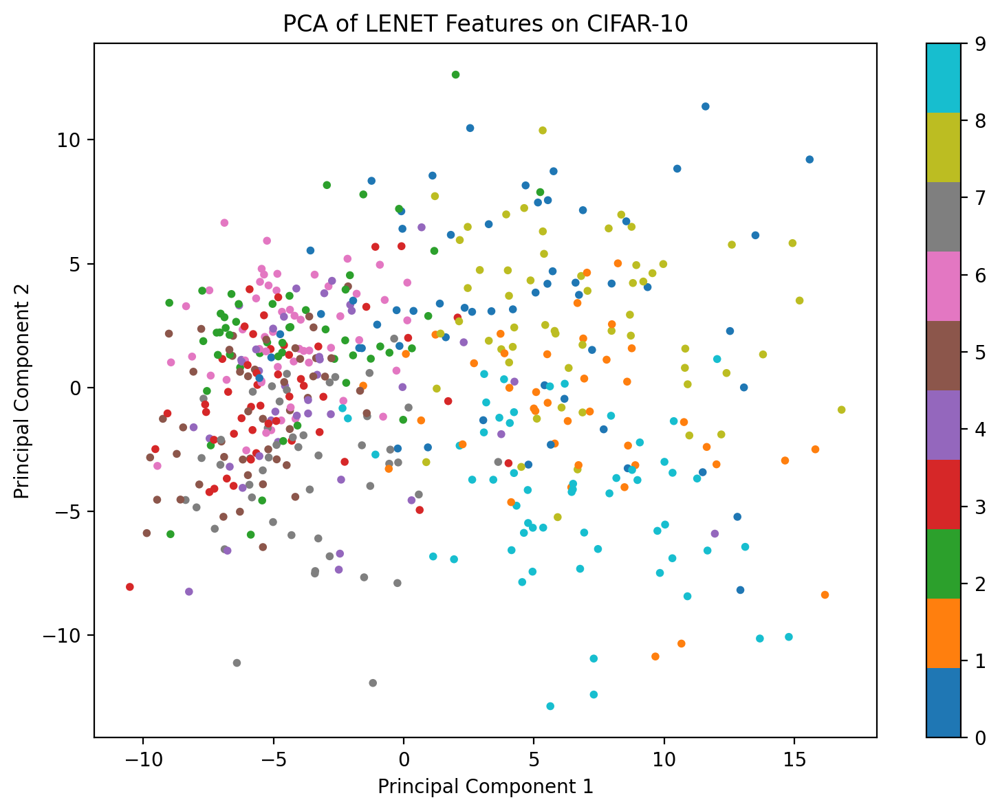
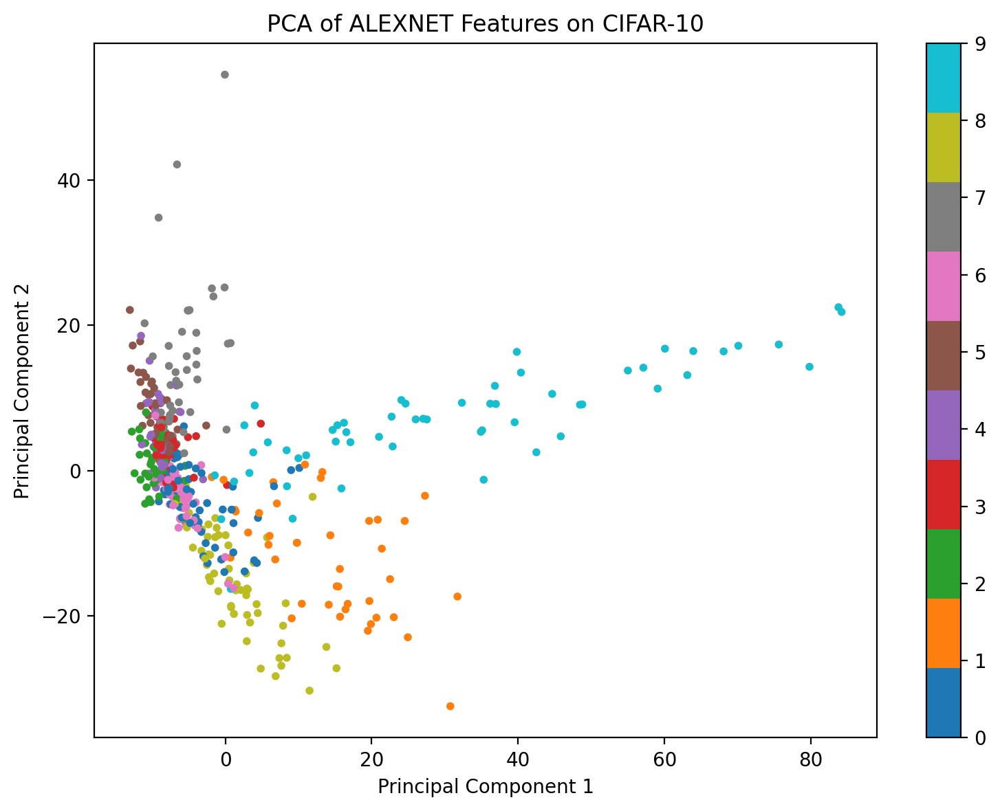
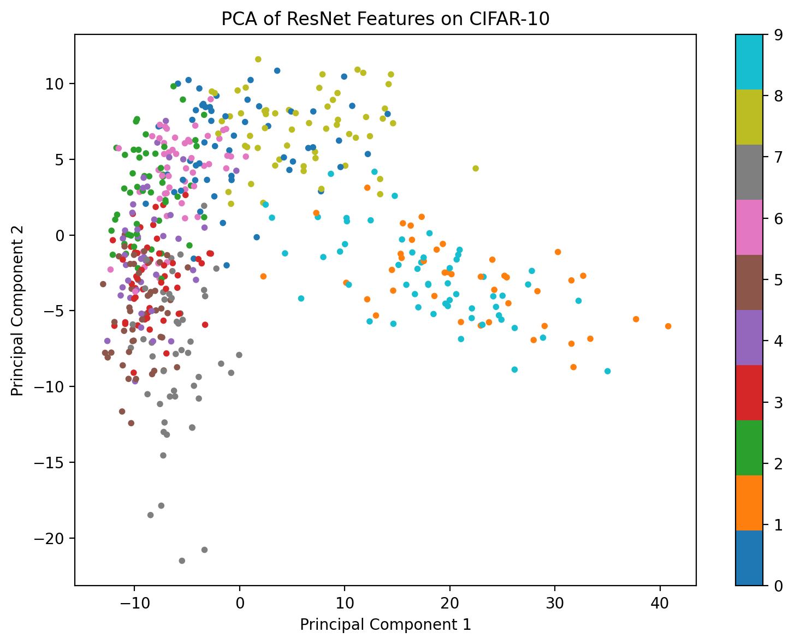

# CNN Architecture Study: Representation and Robustness

## Overview
This project presents a comparative study of three classical convolutional neural network (CNN) architectures: LeNet, AlexNet, and ResNet. The goal is to analyze how network depth and architectural design influence representation learning, training dynamics, and robustness.

## Research Question
How do different CNN architectures (LeNet, AlexNet, ResNet) differ in:
- Representation quality?
- Convergence behavior during training?
- Robustness to input perturbations?

## Dataset
- CIFAR-10 dataset
- 10 classes of natural images
- Standard train/test split

## Models
- **LeNet**: shallow CNN baseline
- **AlexNet**: deeper CNN with larger capacity
- **ResNet**: deep residual network with skip connections

## Experimental Setup
- Same dataset and preprocessing for all models
- Same training pipeline for fair comparison
- Evaluation metrics:
  - Accuracy
  - Loss
  - Convergence speed

## Analysis Plan
This project focuses not only on model performance but also on understanding model behavior:

1. **Training Dynamics**
   - Compare loss and accuracy curves
   - Analyze convergence stability

2. **Representation Learning**
   - Extract features from trained models
   - Visualize using t-SNE / PCA
   - Compare separability of learned representations

3. **Robustness Analysis**
   - Evaluate models under input perturbations:
     - Gaussian noise
     - Blur
   - Compare performance degradation

## Expected Outcomes
- Deeper architectures (ResNet) will learn more discriminative representations
- Residual connections improve training stability
- Model depth influences robustness to noise

## Reproducibility
The codebase is organized for reproducible experiments:
- Unified training pipeline
- Configurable experiment settings
- Clear separation of models, training, and analysis

## Results
| Model | Test Accuracy | Best Validation Accuracy |
|---|---:|---:|
| LeNet | 0.6047 | 0.5752 |
| AlexNet | 0.7773 | 0.7668 |
| ResNet | 0.8600 | 0.8606 |

## Representation Learning (PCA Visualization)

We visualize learned feature representations using PCA for different CNN architectures:

### LeNet

### AlexNet

### ResNet

The PCA visualizations show that feature representations become progressively more separable from LeNet to AlexNet to ResNet. 

LeNet features are highly overlapping, indicating weak representation learning. AlexNet shows partial separation, while ResNet produces the most structured and clearly separated clusters. 

This demonstrates that deeper architectures learn more discriminative representations, which explains their improved classification performance.

## Robustness Analysis

We evaluated model robustness under Gaussian noise with standard deviation 0.15.

| Model | Clean Accuracy | Noisy Accuracy | Drop |
|---|---:|---:|---:|
| LeNet | 0.6047 | 0.6000 | 0.0047 |
| AlexNet | 0.7773 | 0.7188 | 0.0585 |
| ResNet | 0.8600 | 0.8042 | 0.0558 |

The results show that all models degrade under noise, with AlexNet and ResNet exhibiting larger absolute drops due to their stronger reliance on learned feature structure.

## Conclusion
This study shows that deeper CNN architectures significantly improve performance on CIFAR-10. 

- AlexNet outperforms LeNet due to increased depth and model capacity  
- ResNet achieves the best performance, demonstrating the effectiveness of residual connections in training deep networks  
- Residual connections also lead to more stable and faster convergence  

Overall, model depth and architectural design play a critical role in representation learning and generalization performance.

## Future Work
- Extend to Transformer-based models (e.g., Vision Transformer)
- Explore multimodal extensions (vision-language models)
